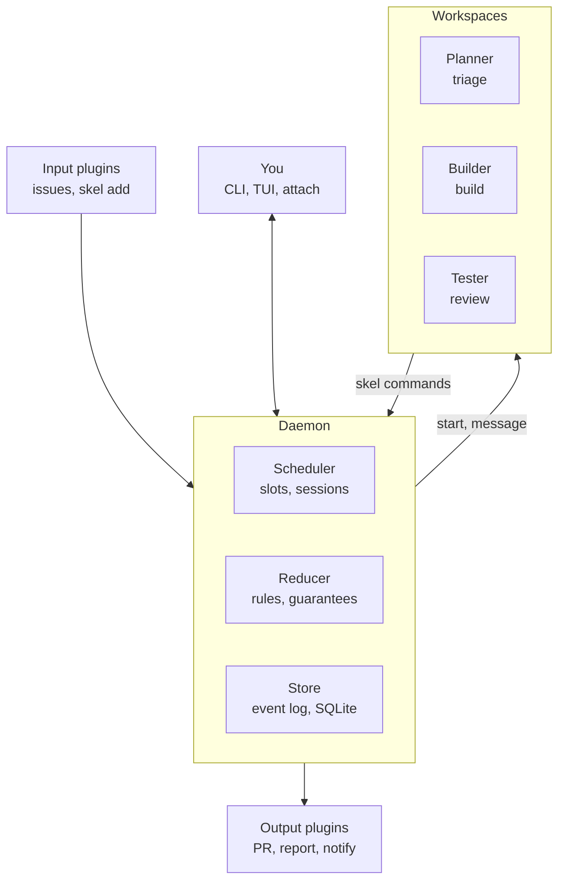
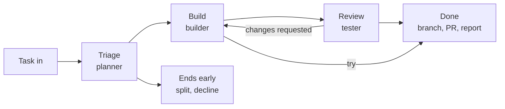

# Skelcrew spec

## Summary

Skelcrew runs coding agents in parallel, always on and unattended. Plugins connect it to the tools you already use, from GitHub and your tracker to Slack and monitoring. Each task is triaged, built and reviewed by separate agents in isolated workspaces, and a deterministic decider with an append only log makes every step trustworthy and auditable. You make decisions; you don't supervise.

Skelcrew is plumbing. It does not try to make agents smarter. It starts vanilla harnesses (Claude Code, Codex) with a task and a role, keeps track of what is happening, and hands finished work to the tools that already own the rest of the workflow.

## Core concepts

1. **Parallel, always on, unattended.** The goal. Several coding agents work at once, keep working while you're away, and don't need watching.
2. **I/O.** What unattended requires. Work comes in from where it's tracked, and questions, approvals and results reach you wherever you are. Unattended means tasks, not chat.
3. **Plugins.** How Skelcrew sits in the middle of your chosen dev tooling instead of replacing it.
4. **Phases and roles.** How work gets judgment and checking without a human in the loop. Every task is triaged, built and reviewed, by planner, builder and tester.
5. **Workspaces with isolation.** Where agents work, and what keeps them inside the rules.
6. **A deterministic decider and an append only log.** What makes unattended trustworthy. Every transition follows the rules, and everything that happened can be replayed and audited.
7. **You make decisions, not supervision.** Direction, questions and approvals reach you. Babysitting and routine diffs don't.

## Premises and principles

- **Models improve faster than anyone can tinker around them.** Anything built to compensate for today's model weaknesses becomes dead code. Plumbing for the human does not. The test for every feature: if the next model is twice as good, does this become dead code? If yes, don't build it.
- **Simple and dumb.** The core knows as little as possible.
- **Small pieces, loosely joined.** Each tool owns one job. Skelcrew is the joints between them.
- **Guarantees in code, judgment in agents.** The agent proposes, the reducer disposes.
- **Enforce by capability, not instruction.** Agents cannot bypass a rule because they never hold the power it protects.
- **Nothing trapped.** Tasks live in the tracker, code and plans in git, transcripts in the harness. Skelcrew stores control state and history.

**Non goals:** a skill library or prompt framework, an IDE or diff viewer, a task manager, merging or deploying code, agent to agent protocols, team features.

## v1 scope

v1 is what's needed to dogfood: one person, one machine, building Skelcrew with Skelcrew.

**In v1**

- Daemon, CLI and the full lifecycle: triage, build, review
- Intents `ship`, `try`, `answer`; rigor `light`, `full`; the approval flag
- Planner, builder and tester on Claude Code
- Worktree workspaces (isolation `none`) with the harness sandbox on
- tmux sessions, with attach
- Local inbox (`skel add`) as the task source; a branch or a report file as output
- Slots, pausing and starting
- Event log in SQLite, recovery after restart

**Right after v1**, in order: GitHub (issues in, PRs out, auto merge), the TUI, herdr, notifications.

Everything else is in Later.

## Terms

- **Task**: a unit of work with a source and a source ID (a GitHub issue, or a local task from `skel add`).
- **Phase**: triage, build or review. Always in that order; review is the only optional one.
- **Intent**: what the task produces: `ship`, `try` or `answer`.
- **Rigor**: how much care it gets: `light` or `full`. Plus an **approval** flag for work that needs your sign off.
- **Role**: who works a phase: planner (triage), builder (build), tester (review). A role is a config entry: instructions, harness, model.
- **Workspace**: where an agent works. A git worktree in v1.
- **Session**: an interactive harness running in a workspace, inside tmux. Never headless, so you can always attach.
- **Event**: everything that happens to a task, in an append only log. State is derived from events.
- **Plugin**: anything that connects Skelcrew to the outside world.

## Architecture



- **The daemon** (`skel serve`) is the only part that holds state or credentials. Any `skel` command starts it if it isn't running.
- **The scheduler** is where orchestration lives: plain code that decides which task gets a slot, which role starts where, and where questions go. There is no supervising agent. The planner comes closest, but it shapes one task once, up front, and hands back data.
- **Clients** (CLI, TUI) talk to the daemon over a local socket and hold no state. Messages are versioned, so the same protocol can later be exposed over the network.
- **Plugins** connect the daemon to the outside world. Agents never talk to the tracker, GitHub or you directly.
- **Agents** get their context when a session starts and act only through `skel` commands. Messages into a session (answers, nudges) go through the session runner.

The core is small enough to be a few hundred lines.

## Queue, not backlog

Adding a task is the commitment: build this. Skelcrew is an orchestration tool with guardrails, not a project management tool.

- **The backlog lives elsewhere.** In your tracker, or wherever you keep ideas. Labeling an issue `crew` or running `skel add` is the decision.
- **There is still a queue.** When more tasks arrive than `max_running` allows, they wait and start in order.
- **No priorities in Skelcrew.** Order comes from when tasks are added.
- **Proposals are not tasks.** Tasks proposed by a split or an answer only enter the queue when you approve them.
- **Removing a task is a decision**: `skel kill`.

## Slots, pausing and starting

`max_running` sets how many agents work at once. A running task holds one slot. A task waiting on you, with you, or paused holds none.

- **Pause** (`skel pause 142`): the agent stops, uncommitted work is committed, the workspace and harness session are kept. The task frees its slot and never restarts on its own.
- **Resume** (`skel resume 142`): the task goes to the front of the queue, continuing its harness session where it left off.
- **Start now** (`skel start 145`): starts immediately if a slot is free. If not, `skel start 145 --pause 142` swaps them atomically, so running agents never exceed `max_running`.
- **Order**: answers to questions first, then resumed tasks, then queued tasks. Oldest first within each.

## Task lifecycle



**Phases**

- **Triage** (planner): decide intent and rigor, write the brief, and a spec when needed.
- **Build** (builder): do the work. What happens inside is the builder's judgment: investigate before fixing a bug, plan briefly before a feature, spike fast for a prototype.
- **Review** (tester): code review and verification. Skipped for `try`. Requested changes go back to build, up to the loop cap.

**Side states**, possible in any phase: **waiting on you** (a question or approval), **with you** (you attached), **paused**. The task resumes in the same phase.

**Endings**: **done** (output handed over), **split** (replaced by proposed tasks), **declined** (handed back with a reason), **killed**, **failed**.

Anything that comes back after done (PR feedback, a production bug) is a new task. State never goes backwards.

## Intent and rigor

Every task gets two small decisions instead of a list of modes. Their behaviour is fixed in v1, not configurable.

### Intent: what the task produces

| Intent | Produces | Edits code? | Mergeable? | Review |
|---|---|---|---|---|
| `ship` | a change that goes to production | yes | yes | yes |
| `try` | a prototype on a branch, plus findings | yes | never | no |
| `answer` | a report, optionally with proposed tasks | no (read only) | n/a | yes, light |

`answer` covers questions about the codebase (why is search slow?), about ideas (what are our options for offline sync?) and designs (how should the export UI work?). If the answer implies work, it proposes tasks rather than starting any.

### Rigor: how much care it gets

| Rigor | Triage | Review |
|---|---|---|
| `light` | brief only | quick code check |
| `full` | brief, plus a spec when the planner judges one needed | code review and verification |

**Approval** is a flag, not a level. It means the task waits for your sign off after review, before anything is handed over. The planner sets it for critical work (auth, payments, migrations, or paths listed as `critical` in config), and you can set it with a label or `--approve`.

### Common combinations

| You'd call it | Intent | Rigor |
|---|---|---|
| quick fix | ship | light |
| bug fix, feature | ship | full |
| security fix | ship | full + approval |
| prototype | try | light |
| investigation, research, design | answer | light or full |

Bug versus feature doesn't change the workflow: a bug just means the builder investigates first.

### What the reducer enforces

- `try` never produces a mergeable output.
- `answer` runs with read only harness permissions, so it can't change code.
- `ship` never reaches done without `review.passed`.
- A task with the approval flag never reaches done without your sign off.

## Triage

Every task starts with triage: a short, cheap run by the planner. It's skipped only when you set intent and rigor yourself.

### Output

One `triaged` event with one of four outcomes:

- **proceed**: here's the intent, rigor and brief
- **ask**: too vague; a question goes to you
- **split**: really several tasks; proposals go to you, the original ends
- **decline**: not now or not needed; handed back to the tracker with a reason you can overrule

For proceed:

```yaml
outcome: proceed
intent: ship        # ship | try | answer
rigor: full         # light | full
approve: false
brief: |
  Export crashes when a report has no rows.
  Likely in the CSV writer's header handling.
  Done when empty reports export a header-only file.
spec: docs/plans/142-empty-export.md   # only when the planner judged one needed
```

### Rules

- **The brief is always there.** The builder starts from it and the tester checks against it: the task restated, a hint of where to look, what done means.
- **A spec is optional**, written by the planner during triage for big or ambiguous work, so build is purely building. Never for `light`.
- **The decision is visible** in `skel ls`, the TUI and as an issue comment, so a wrong call is easy to fix early.
- **Override**: `skel add --ship --light "Fix button color"` skips triage; `skel set 142 --rigor full` changes it and restarts from build.

## Review

The tester works in its own workspace, checked out from the commit the builder handed over, so nothing the builder does afterwards can change what was checked.

- **Code review**: an adversarial read against the brief and spec. A change can pass every test and still be unsound.
- **Verification**: run the project with the repo's `setup` and `test` commands, and collect evidence that it works (test results, and screenshots or a preview where it applies). A failing command fails review.

The verdict goes through the daemon. The evidence is part of what done hands over: in the PR description for `ship`, alongside the report for `answer`.

## Workspaces

A workspace always holds a checkout of the repo on the task's branch, read only for `answer`. Skelcrew treats every workspace the same: create, start a session, attach, run commands, stop, remove.

**v1: worktrees, isolation `none`.** The harness runs as you on your machine. Two things add some protection:

- **The harness's own sandbox** (limiting shell commands' file and network access) is on by default.
- **Agents get no credentials of their own.** Without a container they may still find yours on disk, so this is a speed bump, not a wall.

Under `none`, the rules hold for agents that use Skelcrew's protocol, but an agent that goes around Skelcrew can do anything you can. The TUI says so. Real enforcement comes with the `local` (container) and `remote` isolation levels in Later.

## Agent protocol

Agents talk to Skelcrew only through the CLI. Each command is a proposal; the reducer accepts or rejects it with a reason.

```
# planner
skel triage proceed --intent ship --rigor full [--approve] --brief brief.md [--spec spec.md]
skel triage ask "Should archived items be included?" [--option yes --option no]
skel triage split tasks.md
skel triage decline "Already fixed in #131"

# builder
skel ask "Keep the old export format too?" [--option ...]
skel progress "Found the cause: header row skipped when empty"
skel done --summary summary.md                   # ship, try
skel done --report report.md [--tasks tasks.md]  # answer
skel give-up "Needs credentials I don't have"

# tester
skel pass --evidence evidence.md
skel changes findings.md
```

- **Who is calling.** Each session gets a secret token in an environment variable. The daemon maps it to a task, role and phase, and refuses anything outside them: a builder can't pass its own review. No token means the human. (Not a lock under `none`, see Workspaces.)
- **One open question per task.**
- **Short replies**, like chat messages.
- **Commands block** until accepted or rejected.

## Core model

A pure reducer over an event log. Everything that touches the world carries out the commands it returns.

```
decide(state, input, config) -> { events, commands } | { rejected: reason }
evolve(state, event)         -> state
```

- **No hidden inputs.** Time and IDs are passed in, so replay reproduces bugs exactly.
- **Request numbers.** Every command expecting a reply carries a number from a counter on the task; a late or repeated reply is refused, so finished work can't hijack a task that has moved on.

### Task state

```ts
type Task = {
  id: number                 // shown as #142
  source: string             // "local", "github"
  sourceId: string
  title: string
  phase: "triage" | "build" | "review"
  status: "queued" | "running" | "waiting" | "with_you" | "paused"
        | "done" | "split" | "declined" | "killed" | "failed"
  intent?: "ship" | "try" | "answer"
  rigor?: "light" | "full"
  approve: boolean
  brief?: string
  specPath?: string
  branch?: string
  workspace?: { id: string; path: string }
  session?: { id: string; role: "planner" | "builder" | "tester"; harnessSessionId?: string }
  loops: number
  question?: { text: string; options: string[] }
  requestSeq: number
  usage: { tokens: number; workingMinutes: number }
}
```

### Events

| Event | Meaning |
|---|---|
| `task.received` | a task arrived |
| `task.triaged` | proceed, ask, split or decline |
| `task.set` | you changed intent, rigor or approval |
| `phase.started` | a role's session started |
| `question.asked` / `question.answered` | an agent asked; you answered |
| `session.attached` / `session.detached` | you stepped in or out |
| `task.paused` / `task.resumed` / `task.started` | you paused, resumed or started a task |
| `build.done` | the builder handed over |
| `main.merged` / `main.conflict` | the branch was brought up to date with main |
| `review.passed` / `review.changes_requested` | the tester's verdict |
| `approval.given` / `approval.denied` | your sign off |
| `output.delivered` | the output plugin confirmed; the task is done |
| `agent.stalled` / `agent.crashed` | a session went quiet or ended without reporting |
| `task.killed` / `task.failed` | you stopped it, or it ran out of retries or budget |

Events are versioned from day one.

### Invariants

Property tested, and approved before implementation:

- Replaying the log always yields the same state.
- Rejected inputs and replies with the wrong request number never change state.
- `ship` never reaches done without `review.passed`.
- A task with the approval flag never reaches done without `approval.given`.
- `try` never produces a mergeable output.
- `answer` never starts a session with edit permissions.
- A task has at most one running session and one slot.
- Running tasks never exceed `max_running`, including during a swap.
- A paused task never restarts without you.
- No workspace or session is ever left untracked.
- Nothing leaves an ending.

## Keeping up with main

Before review, the daemon merges main into the task branch. Conflicts go back to the builder, so the tester always checks against current main. After done, the PR and CI handle drift. Skelcrew never force pushes.

## Failure handling

- **Crash** (session ends without reporting): one automatic retry with a fresh session, then waiting on you.
- **Stall** (no activity for 20 minutes): one nudge, then waiting on you.
- **Loop cap** (3 build and review round trips): waiting on you, with the tester's findings.
- **Budget** (working minutes, counted only while an agent works): waiting on you. Placeholders until dogfooding: 30 minutes for `light`, 2 hours for `full`.
- **Workspace or session fails to start**: one retry, then waiting on you.
- **Output delivery fails**: retried with backoff; the task is done only when delivery is confirmed.

Every failure that reaches you says what happened in one line and offers the actions that fit.

## Storage

SQLite on the machine running the daemon.

- **Stored:** the event log, the task projection derived from it, and mappings from source IDs to workspace, session, branch and PR.
- **Not stored:** tasks themselves (tracker or local inbox), code and specs (the repo, specs in `docs/plans`), transcripts (the harness; Skelcrew keeps a pointer, which is what makes resume work), secrets (environment or keychain).

**Recovery.** On restart, the daemon rebuilds state from the log, checks each workspace and session, and reattaches, resumes, or restarts the step from the last commit. Losing the database loses control of in flight tasks and history, never work.

## Plugins

| Event | Direction | Example |
|---|---|---|
| `task.in` | input → core | `skel add`, an issue labeled `crew` |
| `answer.in` | input → core | a reply to a question |
| `question.out` | core → output | an issue comment, a notification |
| `status.out` | core → output | a label or comment mirroring progress |
| `work.out` | core → output | a branch, a PR, a report |
| `decline.out` | core → output | remove the `crew` label with a reason |

Plugin kinds: task sources, outputs, harnesses, workspaces, session runners, notifications.

**GitHub output** (right after v1): on done, open a PR from the reviewed branch with the evidence in its description. With `auto_merge: true` (off by default) it enables GitHub's auto merge but never merges directly; branch protection, CI and CODEOWNERS decide what lands.

## Human interface

Everything important reaches you through notifications and the tracker. The CLI and TUI are conveniences.

### Workflow

1. Add a task (`skel add`, or label an issue).
2. The planner triages it. Several tasks run in parallel.
3. If an agent must ask, you get the question and reply in one line.
4. Builder and tester loop until the work passes, with evidence.
5. Done: a branch or PR (auto merged if allowed), or a report.
6. When something feels off, attach and talk to the agent directly.

### CLI

```
skel add "Fix button color on settings"   # new task; --ship/--try/--answer, --light/--full, --approve skip triage
skel ls                                    # tasks, phase, intent and rigor
skel set 142 --rigor full                  # change intent, rigor or approval; restarts from build
skel reply 142 "No, skip archived items"   # answer a question
skel approve 142 / skel deny 142 "why"     # sign off on a flagged task, or on proposed tasks
skel attach 142                            # enter the agent's session
skel path 142                              # print the worktree path: lazygit -p $(skel path 142)
skel open 142                              # shell in the worktree
skel pause 142 / skel resume 142
skel start 145 [--pause 142]
skel kill 142
```

### TUI (right after v1)

A glance and act surface, not a workspace.

```
skelcrew   3 running · 4 slots
─────────────────────────────────
NEEDS YOU (2)
 ? Archived items in export?
   #142 ship · full · build · 3m
 ✓ Approve: auth token refresh
   #138 ship · full · approve

RUNNING (3)
 ● #145 Fix button color
   ship · light · build · 2m
 ● #140 Search index
   ship · full · review · loop 2

PAUSED (1) · QUEUED (2) · DONE TODAY (5)
─────────────────────────────────
a attach  r reply  p pause  ⏎ start
```

Needs you first; if that section is empty, close the TUI. One quiet line per task, no log firehose. Selecting a task shows its brief, timeline, last agent activity, tester findings and evidence.

### Chat mode

Entering chat mode is attaching to the task's session.

- The task moves to with you; the loop leaves it alone.
- Detaching hands it back to its phase, moves it to review, or marks it done.
- The conversation is part of the task's history.
- If the session has ended, the harness's resume reopens it with full context.

### Inspecting work

Skelcrew doesn't show diffs. `skel path` and `skel open` take you to the worktree, where lazygit, nvim or anything else works, including on uncommitted changes. Builders use predictable branch names (`skel/142-json-export`) and commit often. Editing alongside an agent needs no special handling; to stop it, attach or pause.

Watching diffs is optional: the tester's findings and evidence are the default way of knowing what happened.

## Configuration (v1)

```yaml
# skelcrew.yaml
roles:
  planner:
    harness: claude
    model: fast
    instructions: |
      Decide intent and rigor, set approve for critical work,
      write a brief of a few lines, and a spec only when needed.
      Ask, split or decline when proceeding isn't right.
  builder:
    harness: claude
    instructions: |
      Do the work the intent asks for. Commit often.
      Ask only when a decision is genuinely the human's.
  tester:
    harness: claude
    instructions: |
      Review the change adversarially against the brief,
      then run it and collect evidence that it works.
      Pass with evidence, or request changes.

repo:
  setup:    [bun install --frozen-lockfile]
  test:     [bun test, bun run typecheck]
  critical: [src/auth/**, migrations/**]

limits:
  max_running: 4
```

## Build plan

Start over rather than rewriting v1, but carry its lessons.

1. **Core, attended.** Types, events and invariants approved first, then the reducer with a test per transition, property tests, and a simulator that runs whole lifecycles with scripted replies.
2. **Smallest real loop.** `skel add` → planner → builder in a worktree with tmux → tester in its own worktree → a branch.
3. **Dogfood.** v2 builds the rest of v2. Freeze v1.
4. **Right after v1:** GitHub, the TUI, herdr, notifications.

Track from step 3: questions per task, minutes spent on decisions, tester catch rate, tasks reaching done without you, cost per task.

## Later

- **Isolation levels** `local` (a container on your machine) and `remote` (another box), where enforcement by capability becomes real and agents keep working while your laptop is closed.
- **More plugins**: Codex and pi as harnesses (pi's RPC mode allows steering without typing into terminals), Linear and Basecamp as trackers, an error tracker as input (deduped, new or regressed errors only, with a brake against fix loops), preview deploys as output, OpenClaw or Slack as channels.
- **Remote clients**: the same protocol over the network, which is also what a hosted control plane would be.
- **Handoffs**: push a half finished branch as a task, or hand off a job from inside a chat session.
- **Agent maintained skills**: when the same correction happens twice, an agent writes a skill into the repo, and prunes skills that stop changing outcomes when models improve.
- **Configurable intent and rigor**, once someone needs it.
- **Teams**: shared through the tracker, PRs and git at first; a possible paid tier later (shared rules, shared runners, collision awareness, decision routing, audit).
- **Business model**: open source everything local; sell a hosted control plane, then a team and governance tier.

## Open questions

- Should triage stay a separate role, or become the builder's first step once models can do both in one run?
- Where are proposed tasks approved: tracker, TUI, or both?
- What does verification evidence look like per project type?
- The plugin interface: process per plugin or in process modules, and how third party plugins are trusted.
- Current plugin surfaces of herdr and other tools need checking before committing.
